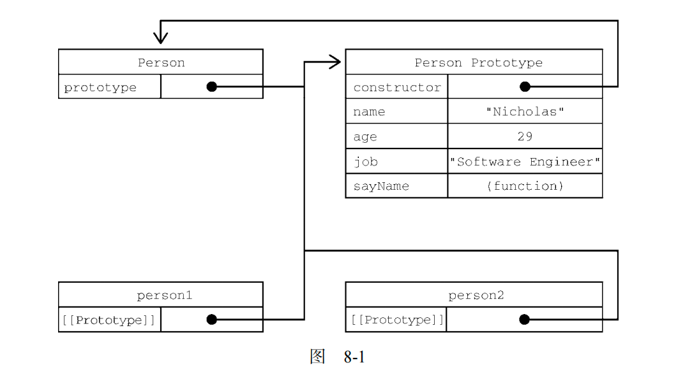
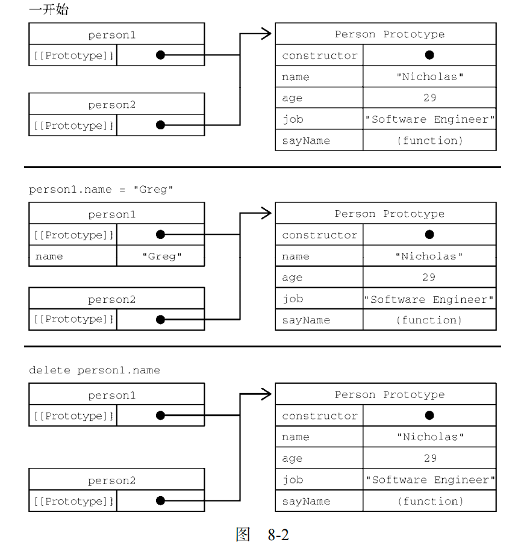

## 函数的原型和原型对象
每个函数都会创建一个 prototype 属性，这个属性是一个对象，包含应该由特定引用类型的实例共享的属性和方法。实际上，这个对象就是通过调用构造函数创建的对象的原型。使用原型对象的好处是，在它上面定义的属性和方法可以被对象实例共享。原来在构造函数中直接赋给对象实例的值，可以直接赋值给它们的原型，如下所示：
```javascript
function Person() {} 
Person.prototype.name = "Nicholas"; 
Person.prototype.age = 29; 
Person.prototype.job = "Software Engineer"; 
Person.prototype.sayName = function() { 
 console.log(this.name); 
}; 
let person1 = new Person(); 
person1.sayName(); // "Nicholas" 
let person2 = new Person(); 
person2.sayName(); // "Nicholas" 
console.log(person1.sayName == person2.sayName); // true
```
使用函数表达式也可以：
```javascript
let Person = function() {}; 
Person.prototype.name = "Nicholas"; 
Person.prototype.age = 29; 
Person.prototype.job = "Software Engineer"; 
Person.prototype.sayName = function() { 
 console.log(this.name); 
}; 
let person1 = new Person(); 
person1.sayName(); // "Nicholas" 
let person2 = new Person(); 
person2.sayName(); // "Nicholas" 
console.log(person1.sayName == person2.sayName); // true
```
这里，所有属性和 sayName()方法都直接添加到了 Person 的 prototype 属性上，构造函数体中
什么也没有。但这样定义之后，调用构造函数创建的新对象仍然拥有相应的属性和方法。与构造函数模
式不同，使用这种原型模式定义的属性和方法是由所有实例共享的。因此 person1 和 person2 访问的
都是相同的属性和相同的 sayName()函数。要理解这个过程，就必须理解 ECMAScript 中原型的本质。

### 理解原型
无论何时，只要创建一个函数，就会按照特定的规则为这个函数创建一个 prototype 属性（指向原型对象）。默认情况下，所有原型对象自动获得一个名为 constructor 的属性，指回与之关联的构
造函数。对前面的例子而言，Person.prototype.constructor 指向 Person。然后，因构造函数而异，可能会给原型对象添加其他属性和方法。

在自定义构造函数时，原型对象默认只会获得 constructor 属性，其他的所有方法都继承自 Object。每次调用构造函数创建一个新实例，这个实例的内部[[Prototype]]指针就会被赋值为构
造函数的原型对象。脚本中没有访问这个[[Prototype]]特性的标准方式，但 Firefox、Safari 和 Chrome 会在每个对象上暴露__proto__属性，通过这个属性可以访问对象的原型。在其他实现中，这个特性完全被隐藏了。关键在于理解这一点：实例与构造函数原型之间有直接的联系，但实例与构造函数之间没有。

这种关系不好可视化，但可以通过下面的代码来理解原型的行为：
```javascript
* 构造函数可以是函数表达式
 * 也可以是函数声明，因此以下两种形式都可以：
 * function Person() {} 
 * let Person = function() {} 
 */ 
function Person() {} 
/** 
 * 声明之后，构造函数就有了一个
 * 与之关联的原型对象：
 */ 
console.log(typeof Person.prototype); 
console.log(Person.prototype); 
// { 
// constructor: f Person(), 
// __proto__: Object
// } 
/** 
 * 如前所述，构造函数有一个 prototype 属性
 * 引用其原型对象，而这个原型对象也有一个
 * constructor 属性，引用这个构造函数
 * 换句话说，两者循环引用：
 */ 
console.log(Person.prototype.constructor === Person); // true 
/** 
 * 正常的原型链都会终止于 Object 的原型对象
 * Object 原型的原型是 null 
 */ 
console.log(Person.prototype.__proto__ === Object.prototype); // true 
console.log(Person.prototype.__proto__.constructor === Object); // true 
console.log(Person.prototype.__proto__.__proto__ === null); // true 
console.log(Person.prototype.__proto__); 
// { 
// constructor: f Object(), 
// toString: ... 
// hasOwnProperty: ... 
// isPrototypeOf: ... 
// ... 
// } 
let person1 = new Person(), 
 person2 = new Person(); 
/** 
 * 构造函数、原型对象和实例
 * 是 3 个完全不同的对象：
 */ 
console.log(person1 !== Person); // true 
console.log(person1 !== Person.prototype); // true 
console.log(Person.prototype !== Person); // true 
/** 
 * 实例通过__proto__链接到原型对象，
 * 它实际上指向隐藏特性[[Prototype]] 
 * 
 * 构造函数通过 prototype 属性链接到原型对象
 * 
 * 实例与构造函数没有直接联系，与原型对象有直接联系
 */ 
console.log(person1.__proto__ === Person.prototype); // true 
conosle.log(person1.__proto__.constructor === Person); // true 
/** 
 * 同一个构造函数创建的两个实例
 * 共享同一个原型对象：
 */ 
console.log(person1.__proto__ === person2.__proto__); // true 
/** 
 * instanceof 检查实例的原型链中
 * 是否包含指定构造函数的原型：
 */ 
console.log(person1 instanceof Person); // true 
console.log(person1 instanceof Object); // true 
console.log(Person.prototype instanceof Object); // true
```
对于前面例子中的 Person 构造函数和 Person.prototype，可以通过图 8-1 看出各个对象之间的关系。



虽然不是所有实现都对外暴露了[[Prototype]]，但可以使用 isPrototypeOf()方法确定两个对象之间的这种关系。本质上，isPrototypeOf()会在传入参数的[[Prototype]]指向调用它的对象时返回 true，如下所示：
```javascript
console.log(Person.prototype.isPrototypeOf(person1)); // true 
console.log(Person.prototype.isPrototypeOf(person2)); // true 
```
这里通过原型对象调用 isPrototypeOf()方法检查了 person1 和 person2。因为这两个例子内部都有链接指向 Person.prototype，所以结果都返回 true。ECMAScript 的 Object 类型有一个方法叫 Object.getPrototypeOf()，返回参数的内部特性[[Prototype]]的值。例如：
```javascript
console.log(Object.getPrototypeOf(person1) == Person.prototype); // true 
console.log(Object.getPrototypeOf(person1).name); // "Nicholas" 
```
第一行代码简单确认了 Object.getPrototypeOf()返回的对象就是传入对象的原型对象。第二行代码则取得了原型对象上 name 属性的值，即"Nicholas"。使用 Object.getPrototypeOf()可以方便地取得一个对象的原型，而这在通过原型实现继承时显得尤为重要。

Object 类型还有一个 setPrototypeOf()方法，可以向实例的私有特性[[Prototype]]写入一个新值。这样就可以重写一个对象的原型继承关系：
```javascript
let biped = { 
 numLegs: 2 
}; 
let person = { 
 name: 'Matt' 
}; 
Object.setPrototypeOf(person, biped); 
console.log(person.name); // Matt 
console.log(person.numLegs); // 2 
console.log(Object.getPrototypeOf(person) === biped); // true
```

> 警告 Object.setPrototypeOf()可能会严重影响代码性能。Mozilla 文档说得很清楚：“在所有浏览器和 JavaScript 引擎中，修改继承关系的影响都是微妙且深远的。这种影响并不仅是执行 Object.setPrototypeOf()语句那么简单，而是会涉及所有访问了那些修改过[[Prototype]]的对象的代码。


为避免使用 Object.setPrototypeOf()可能造成的性能下降，可以通过 Object.create()来创
建一个新对象，同时为其指定原型：
```javascript
let biped = { 
 numLegs: 2 
}; 
let person = Object.create(biped); 
person.name = 'Matt'; 
console.log(person.name); // Matt 
console.log(person.numLegs); // 2 
console.log(Object.getPrototypeOf(person) === biped); // true
```

### 原型层级（原型属性和实例属性）
在通过对象访问属性时，会按照这个属性的名称开始搜索。搜索开始于对象实例本身。如果在这个实例上发现了给定的名称，则返回该名称对应的值。如果没有找到这个属性，则搜索会沿着指针进入原型对象，然后在原型对象上找到属性后，再返回对应的值。因此，在调用 person1.sayName()时，会发生两步搜索。首先JavaScript 引擎会问：“person1 实例有 sayName 属性吗？”答案是没有。然后，继续搜索并问：“person1 的原型有 sayName 属性吗？”答案是有。于是就返回了保存在原型上的这个函数。在调用 person2.sayName()时，会发生同样的搜索过程，而且也会返回相同的结果。这就是原型用于在多个对象实例间共享属性和方法的原理。

虽然可以通过实例读取原型对象上的值，但不可能通过实例重写这些值。如果在实例上添加了一个与原型对象中同名的属性，那就会在实例上创建这个属性，这个属性会遮住原型对象上的属性。下面看一个例子：
```javascript
function Person() {} 
Person.prototype.name = "Nicholas"; 
Person.prototype.age = 29; 
Person.prototype.job = "Software Engineer"; 
Person.prototype.sayName = function() { 
 console.log(this.name); 
}; 
let person1 = new Person(); 
let person2 = new Person(); 
person1.name = "Greg"; 
console.log(person1.name); // "Greg"，来自实例
console.log(person2.name); // "Nicholas"，来自原型
```
在这个例子中，person1 的 name 属性遮蔽了原型对象上的同名属性。虽然 person1.name 和 person2.name 都返回了值，但前者返回的是"Greg"（来自实例），后者返回的是"Nicholas"（来自原型）。当 console.log()访问 person1.name 时，会先在实例上搜索个属性。因为这个属性在实例上存在，所以就不会再搜索原型对象了。而在访问 person2.name 时，并没有在实例上找到这个属性，所以会继续搜索原型对象并使用定义在原型上的属性。

只要给对象实例添加一个属性，这个属性就会遮蔽（shadow）原型对象上的同名属性，也就是虽然不会修改它，但会屏蔽对它的访问。即使在实例上把这个属性设置为 null，也不会恢复它和原型的联系。不过，使用 delete 操作符可以完全删除实例上的这个属性，从而让标识符解析过程能够继续搜索原型对象。
```javascript
function Person() {} 
Person.prototype.name = "Nicholas"; 
Person.prototype.age = 29; 
Person.prototype.job = "Software Engineer"; 
Person.prototype.sayName = function() { 
 console.log(this.name); 
}; 
let person1 = new Person(); 
let person2 = new Person(); 
person1.name = "Greg"; 
console.log(person1.name); // "Greg"，来自实例
console.log(person2.name); // "Nicholas"，来自原型
delete person1.name; 
console.log(person1.name); // "Nicholas"，来自原型
```
这个修改后的例子中使用 delete 删除了 person1.name，这个属性之前以"Greg"遮蔽了原型上的同名属性。然后原型上 name 属性的联系就恢复了，因此再访问 person1.name 时，就会返回原型对象上这个属性的值。

hasOwnProperty()方法用于确定某个属性是在实例上还是在原型对象上。这个方法是继承自 Object 的，会在属性存在于调用它的对象实例上时返回 true，如下面的例子所示：
```javascript
function Person() {} 
Person.prototype.name = "Nicholas";
Person.prototype.age = 29; 
Person.prototype.job = "Software Engineer"; 
Person.prototype.sayName = function() { 
 console.log(this.name); 
}; 
let person1 = new Person(); 
let person2 = new Person(); 
console.log(person1.hasOwnProperty("name")); // false 
person1.name = "Greg"; 
console.log(person1.name); // "Greg"，来自实例
console.log(person1.hasOwnProperty("name")); // true 
console.log(person2.name); // "Nicholas"，来自原型
console.log(person2.hasOwnProperty("name")); // false 
delete person1.name; 
console.log(person1.name); // "Nicholas"，来自原型
console.log(person1.hasOwnProperty("name")); // false
```
在这个例子中，通过调用 hasOwnProperty()能够清楚地看到访问的是实例属性还是原型属性。调用 person1.hasOwnProperty("name")只在重写 person1 上 name 属性的情况下才返回 true，表明此时 name 是一个实例属性，不是原型属性。图 8-2 形象地展示了上面例子中各个步骤的状态。（为简单起见，图中省略了 Person 构造函数。）



> 注意 ECMAScript 的 Object.getOwnPropertyDescriptor()方法只对实例属性有效。要取得原型属性的描述符，就必须直接在原型对象上调用 Object.getOwnProperty-Descriptor()。

## 原型链
ECMA-262 把原型链定义为 ECMAScript 的主要继承方式。其基本思想就是通过原型继承多个引用类型的属性和方法。重温一下构造函数、原型和实例的关系：每个构造函数都有一个原型对象，原型有一个属性指回构造函数，而实例有一个内部指针指向原型。如果原型是另一个类型的实例呢？那就意味着这个原型本身有一个内部指针指向另一个原型，相应地另一个原型也有一个指针指向另一个构造函数。这样就在实例和原型之间构造了一条原型链。这就是原型链的基本构想。

实现原型链涉及如下代码模式：
```
function SuperType() { 
 this.property = true; 
} 
SuperType.prototype.getSuperValue = function() { 
 return this.property; 
}; 
function SubType() { 
 this.subproperty = false; 
} 
// 继承 SuperType 
SubType.prototype = new SuperType(); 
SubType.prototype.getSubValue = function () {
}; 
let instance = new SubType(); 
console.log(instance.getSuperValue()); // true
```
以上代码定义了两个类型：SuperType 和 SubType。这两个类型分别定义了一个属性和一个方法。这两个类型的主要区别是 SubType 通过创建 SuperType 的实例并将其赋值给自己的原型 SubType.prototype 实现了对 SuperType 的继承。这个赋值重写了 SubType 最初的原型，将其替换为 SuperType 的实例。这意味着 SuperType 实例可以访问的所有属性和方法也会存在于 SubType.prototype。这样实现继承之后，代码紧接着又给 SubType.prototype，也就是这个 SuperType 的实例添加了一个新方法。最后又创建了 SubType 的实例并调用了它继承的 getSuperValue()方法。图 8-4 展示了子类的实例与两个构造函数及其对应的原型之间的关系。

[8-4原型链](./mdImages/原型和原型对象/8-4原型链.png)


这个例子中实现继承的关键，是 SubType 没有使用默认原型，而是将其替换成了一个新的对象。这个
新的对象恰好是 SuperType 的实例。这样一来，SubType 的实例不仅能从 SuperType 的实例中继承属性和方法，而且还与 SuperType 的原型挂上了钩。于是 instance（通过内部的[[Prototype]]）指向 SubType.prototype，而 SubType.prototype（作为 SuperType 的实例又通过内部的[[Prototype]]）
指向 SuperType.prototype。注意，getSuperValue()方法还在 SuperType.prototype 对象上，而 property 属性则在 SubType.prototype 上。这是因为 getSuperValue()是一个原型方法，而 property 是一个实例属性。SubType.prototype 现在是 SuperType 的一个实例，因此 property
才会存储在它上面。还要注意，由于 SubType.prototype 的 constructor 属性被重写为指向SuperType，所以 instance.constructor 也指向 SuperType。

原型链扩展了前面描述的原型搜索机制。我们知道，在读取实例上的属性时，首先会在实例上搜索这个属性。如果没找到，则会继承搜索实例的原型。在通过原型链实现继承之后，搜索就可以继承向上，搜索原型的原型。对前面的例子而言，调用 instance.getSuperValue()经过了 3 步搜索：instance、SubType.prototype 和SuperType.prototype，最后一步才找到这个方法。对属性和方法的搜索会一直持续到原型链的末端。

### 默认原型
实际上，原型链中还有一环。默认情况下，所有引用类型都继承自 Object，这也是通过原型链实现的。任何函数的默认原型都是一个 Object 的实例，这意味着这个实例有一个内部指针指向 Object.prototype。这也是为什么自定义类型能够继承包括 toString()、valueOf()在内的所有默认方法的原因。因此前面的例子还有额外一层继承关系。图 8-5 展示了完整的原型链。

[8-5默认原型](./mdImages/原型和原型对象/8-5默认原型.png)

SubType 继承 SuperType，而 SuperType 继承 Object。在调用 instance.toString()时，实际上调用的是保存在 Object.prototype 上的方法。

